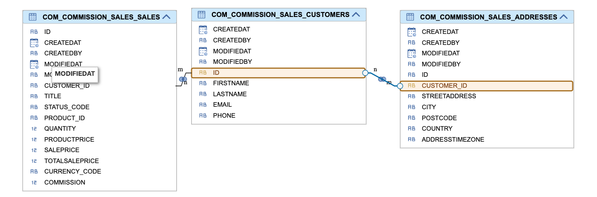

# Getting Started

Welcome to the **Sales-Commission** full stack CAP project. This repository demonstrates design and development of
enterprise grade business application/solution with powerful technology stack with a mix of open source and
SAP technologies.

If you follow this repository you will learn how to:

1. Develop and build Node.JS/CAP application in Business Application Studio.
2. Develop single page applications with standard FIORI elements.
3. Develop custom UI5 applications aligning with FIORI guidelines.
4. Effortlessly integrate your application with cloud services available on SAP BTP.
5. Secure your applications and APIs using XSUAA - advanced authentication and trust management service.
6. Efficiently use SAP managed application router and destination service on BTP.
7. Integrate your application with backend S/4HANA OData APIs.
8. Implement caching in application layer to optimize backend API calls.
9. Create and expose calculation views as OData APIs, ready to be consumed by other SAP or non SAP solutions.

**This project is your gateway to mastering the creation of secure, scalable, and enterprise-grade solutions leveraging cloud services.**

Whether you're an open-source enthusiast, full stack application developer, SAP consultant or an Architect, this project is **THE** starting point for you.

**NOTE:** 
1. As this is a big project, to help you follow, I have given the commit ids at the end of each section which will
help you understand the changes. Feel free to explore other commits in the git repo.
2. As I have refactored the code throughout the journey, do not get confused by the latest code and the previous commits.
3. Throughout the README.md file, I have added SAP offcial developer tutorials for configurations which you can refer
for details of that particular topic. This will surely help you on your way.

# Use Case Statement

A company pioneering pre-owned vehicle sales needs a **Sales Commission Management Application** to streamline the commission calculation process for its employees. The application enables sales representatives to record and update sales transactions efficiently. Once a sale is completed, a sales manager reviews and approves it before final closure.

The sales manager should also be able to maintain the commission config for the application.

The system maintains essential business data, including sales records, customer details, product data and customer address information. If a customer’s address is not available in the internal database, the application automatically retrieves it from the S/4HANA backend system to ensure data accuracy and completeness.

Additionally, the application must provide a comprehensive sales data for analysis. To support third-party analytics tools, it must expose a calculation view as a API, allowing for in-depth reporting and business insights.

Maintain appropriate roles to ensure proper authorization of the application. The application should be accessible from the company's work zone. Application and OData APIs should be secured.

# Set up the *sales-commission* CAP Project

1. Create *CAP Project* from template. 
    - Give project name of your choice
    - Select Runtime. For this project it is Node.js
    - Choose which way to deploy your project. For this project it is *Cloud Foundry - MTA Deployment*
    - Add sample content to your project. For this project I selected *Minimal Sample*

2. This will create a essential structure to start the project.
    ```
    - sales-commission
        |_ app
        |_ db
        |_ srv
        |_.gitignore
        |_mta.yaml
        |_package.json
        |_README.md
    ```

3. File or Folder | Purpose
   ---------------|----------
   `app/`         | content for UI frontends goes here
   `db/`          | your domain models and data go here
   `srv/`         | your service models and code go here
   `.gitignore`.  | git ignore file
   `mta.yaml`.    | multi target application deployment descriptor
   `package.json` | project metadata and configuration
   `README.md`    | this getting started guide

4. Open a new terminal and run `cds watch`.

5. Start adding content, in [db/schema.cds](db/schema.cds). Define sales entities required for the application.

6. Define the service. I have created file - [srv/sales-service.cds](srv/sales-service.cds). 

7. Add data to the in memory database.
    ```
    cds add data 
    ```
8. Now, fill the test data. The above command will generate csv files in the [db/data](db/data) folder. You can copy that data or reuse the csv files in your project.

10. Open the mta.yaml and understand the structure of the file. You will see modules and resources. [Refer for details](https://www.sap.com/documents/2016/06/e2f618e4-757c-0010-82c7-eda71af511fa.html)

11. **You have successfully** 
    - Created a CAP project, 
    - Defined the domain models, 
    - Added service for the models and 
    - Added test data till now.
    - **github commit**: [46851dc](https://github.com/avinashvaidya09/sales-commission/commit/46851dc6af7339b88fb8b524e3df423de0a2e4ab)

## Add standard Fiori Elements

**What are fiori elements?**
 - Fiori elements provides designs for UI patterns and out of the box floorplans for common enterprise application use cases.
 - Using annotations, one can create UI applications using OData services without JavaScript UI coding. 
 - The Fiori UI application uses MVC pattern.
 - SAP UI5 reads the metadata and the annotations of the OData service and creates views at the application startup.

Let's start

1. Make sure the application is running and open *Command Pallete*.

2. Type **Fiori: Open Application Generator**
    - **Template Selection:** List Report Page
        - **Data Source:** Use a Local CAP Project
        - **Choose your CAP project:** sales-commision
        - **OData service:** ProcessorService
    - **Entity Selection**
        - **Main Entity:** Sales
        - **Navigation Entity:** None
        - **Automatically add table columns to the list page and a section to the object page if none already exists?:** Yes
        - **Table Type:** responsive
    -  **Project Attributes**
        - **Module name:** sales
        - **Application title:** Sales-Commission
        - **Application namespace:** ns
        - **Add deployment configuration to MTA project (/home/user/projects/sales-commission/mta.yaml):** Yes
    - **DeploymentConfiguration**
        - **Please choose the target:** Cloud Foundry
        - **Destination name:** None

    Application will take some seconds to generate. You can now see **sales** folder inside **app** folder. Take time to inspect the files inside it. Check the Component.js file inside the webapp folder. It inherits logic from **sap/fe/core/AppComponent** class which is managed by SAP Fiori and provides all the necessary services required for the template to work properly.

3. Refer the [package.json](package.json). You will see few scripts are added. Start the server with following command
    ```
    npm run watch-sales
    ```
    
    **OR**

4. You can also type **Fiori: Open Application Info** from command pallete and click on **Preview Application**. This will start the application and you can see UI with list of sales.

5. Now start configuring the list view. From the application info page, you can click on **Open Page Map**.
I am not detailing each and every step. For quick reference you can refer step 4  of this [Configuring List View](https://developers.sap.com/tutorials/add-fiori-elements-uis.html#0180ca2a-11d5-4d49-91bf-3dbb3a3347df)

6. Now start configuring the detail page. From the application info page, you can click on **Open Page Map**.
I am not detailing each and every step. For quick reference you can refer step 5  of this [Configuring Object Page View](https://developers.sap.com/tutorials/add-fiori-elements-uis.html#9f8b34a1-68f8-41fa-af2a-2cf74428a909)

7. Let us add some custom logic to calculate the total sale price using sale price and quantity and save it in the sales table.
    - Create processor-service.js inside srv folder.
    - I have added event handlers for validations and updating commission.
    - Take a look [srv/processor-service.js](srv/processor-service.js)

8. **You have successfully** 
    - Created a standard FIORI UI web app
    - Created sales list report page and sales detail page, 
    - Enabled Create and Edit functionality. 
    - Added custom event handlers
    - **github commit**: [303381b](https://github.com/avinashvaidya09/sales-commission/commit/303381baffff1b80891672ae28a28ee0dd8e0de9)


## Add Authorization on local

1. Let us start my adding manager service and added annotations for role based access control.
    ```
    /**
     * Service used by sales manager to approve sale and commision.
     */

    service SalesManagerService {

        @title: 'Sales Transactions'  @description: 'Stores sale detail for the sales representative with final sale price.'
        entity Sales            as projection on sales.Sales;
        @readonly
        entity Products         as projection on sales.Products;
        @readonly
        entity Customers        as projection on sales.Customers;
    }

    annotate SalesService with @(requires: 'sales_representative');

    annotate SalesManagerService with @(requires: 'sales_manager');
    ```
2. Add user for local testing. Refer [package.json](package.json). Fragment provided below
    ```
    "cds": {
    "requires": {
      "[development]": {
        "auth": {
          "kind": "mocked",
          "users": {
            "sales-rep@carfox.com":{
              "password": "admin",
              "roles": ["sales_representative"]
            },
            "sales-manager@carfox.com":{
              "password": "admin",
              "roles": ["sales_manager"]
            }
          }
        }
      }
    }
    ```
3. Add a launch page on local to mimic build work zone page - [app/launchpage.html](app/launchpage.html)

4. **You have successfully** 
    - Added authorization on local
    - Added 2 roles for sales rep and sales manager 
    - Added validation that only sales manager can approve the sales record.
    - **github commit**: [4328e67](https://github.com/avinashvaidya09/sales-commission/commit/4328e6798b6348c73835fea6a4b057981a0862b2)

# Prepare the application for Cloud (BTP)

Till now we have done an exceptional work of developing a full stack application, fixing bugs and 
refining it. But we have to make it cloud ready and eventually deploy it in production. Let us upgrade
the application to be production ready.

## Set up SAP HANA Cloud

Add SAP HANA Cloud client to your application. The below command will make changes to the [package.json](package.json). Check your changes in github working tree.

  ```
  cds add hana --for production
  ```
The above command will generate files like - undeploy.json, .hdiconfig as well.
Deployments in BTP are done using production profile by default.
    
**IMP:** Start your application on local and it should be working as is. If it is not, then revisit and fix the issue.

## Add XSUAA support
Next is to configure XSUAA service for authentication and trust management. The below command will make changes to the [package.json](package.json). Check your changes in github working tree.
  ```
  cds add xsuaa --for production
  ```
The above command will generate file - [xs-security.json](xs-security.json). The above command already will create role template and scope as per the annotations defined in the [srv/sales-service.cds](srv/sales-service.cds). Check it out.

**IMP:** Start your application on local and it should be working as is. If it is not, then revisit and fix the issue.

## Add HTML5 application repository
Next is to prepare the application to be part of HTML5 application repository. Obvious question is why we need this step? A quick read - [HTML5 Application Repository](https://help.sap.com/docs/btp/sap-business-technology-platform/html5-application-repository)
  ```
  cds add html5-repo
  ```
The above command will add html5 repo related configuration in the [mta.yaml](mta.yaml). Take a look at the changes in github working tree.

## Build your application for BTP

1. Navigate to **app/sales** and run
    ```
    npm install
    ```
2. Come back to the root of your project and test your build
    ```
    cds build --production
    ```
    There should not be any errors and your should see the last line as - **build completed in ___ ms**

3. Ensure your project is running on local and remember check in the code in **github**. You have done a lot of hard work to reach here.

4. **You have successfully**
    - Added production profile
    - Added HANA cloud client
    - Added support of XSUAA service
    - Added HTML5 application repository configuration
    - **github commit**: [176c81b](https://github.com/avinashvaidya09/sales-commission/commit/176c81b4e539269e46c018232ca3a26e9c8dd10b)


# Prepare for deployment on BTP

1. Before deploying your application on BTP, ensure the below pre-requisites are met. Without these the application deployment will fail
as the supporting entitlements will not be available.
    Name                                          | Plan
    -------------------------------------         |---------------
      **SAP Build Work Zone**                     | Standard Edition or Free              
      **SAP HANA Cloud**                          | hana-free
      **SAP HANA Cloud**                          | tools (Application)
      **SAP HANA Schemas & HDI Containers**       | hdi-shared

2. All the above installations are very well provided in this [Tutorial: Prepare for deployment ](https://developers.sap.com/tutorials/prepare-btp-cf.html#40f3498c-7a3e-4dc8-9a9c-f204c4972731). Please take time to go through it. **NOTE: Give names relevant to your application. You do not have to follow the names provided in the tutorial but adhere to naming conventions**

3. Add configuration for SAP Build WorkZone by running following command
    ```
    cds add workzone-standard
    ```
    The above command will generate destination module and resources in [mta.yaml](mta.yaml) which will be used during deployment. Take time to
    browse through the mta.yaml and understand the modules and resources. This is the very important for your application.

4. Refer [app/sales/webapp/manifest.json](app/sales/webapp/manifest.json) file. I added 3 more attriutes on top of generated *crossNavigation* section. This is how it looks like. I added  **title**, **subTitle** and **icon**. This will be shown on the application card on Build Work Zone. Remember to add title and subtitle in [app/sales/webapp/i18n/i18n.properties](app/sales/webapp/i18n/i18n.properties)
    ```
    "crossNavigation": {
      "inbounds": {
        "sales-display": {
          "semanticObject": "sales",
          "action": "display",
          "title": "{{flpTitle}}",
          "subTitle": "{{flpSubtitle}}",
          "icon": "sap-icon://crm-sales",
          "signature": {
            "parameters": {},
            "additionalParameters": "allowed"
          }
        }
      }
    }
    ```

5. Important part - Remember to remove forward **/** from the uri parameter. The dataSource URI must be relative to the base URL.
    ```
    "dataSources": {
      "mainService": {
        "uri": "odata/v4/processor/",
        "type": "OData",
        "settings": {
          "annotations": [],
          "odataVersion": "4.0"
        }
      }
      ```

6. Open [mta.yaml](mta.yaml). Update the **build-result** and **target-path**  with **resources/** as shown in the below snippet.
    ```
    - name: sales-commission-app-deployer
    type: com.sap.application.content
    path: .
    requires:
      - name: sales-commission-html5-repo-host
        parameters:
          content-target: true
    build-parameters:
      build-result: resources/
      requires:
        - name: salescommissionsales
          artifacts:
            - sales.zip
          target-path: resources/
    ```

7. Open [mta.yaml](mta.yaml). Update the build parameters with additional command as shown below.
    ```
    build-parameters:
    before-all:
    - builder: custom
      commands:
        - npm ci
        - npx cds build --production
        - mkdir -p resources
    ```
8. Your [mta.yaml](mta.yaml) should be ready for deployment now.

# Deploy application on SAP BTP - Cloud Foundry Environment.

1. Run multi target application build
    ```
    mbt build
    ```
    For sure there will be some errors. Check the logs and resolve the errors. If the build is successfull, you should see **sales-commission_1.0.0.mtar** file generated in [mta_archives](mta_archives) folder.

2. Login to your sub account
    ```
    cf api <API-ENDPOINT>
    cf login --sso
    cf target -o <ORG> -s <SPACE>
    ```

3. Run the following command to deploy the tar file
    ```
    cf deploy mta_archives/sales-commission_1.0.0.mtar
    ```
    
    As per my experience, here you will encounter errors. There will be some issues in dependencies of the modules. Be patient. Read the errors
    properly and solve them one by one. Most of the issues will be in [mta.yaml](mta.yaml) Refer the mta.yaml in this repository to compare with yours.
    
4. Check if services are created properly
    ```
    cf services
    ```
5. Once the application is deployed successfully on BTP, assign roles to your user. Follow the steps mentioned in the [User Role Assignment](https://developers.sap.com/tutorials/user-role-assignment.html)

6. To integrate your application with SAP Build Work Zone, follow the steps mentioned in the [Integrate application with Build Work Zone](https://developers.sap.com/tutorials/integrate-with-work-zone.html)

7. **You have successfully**
  - Integrated your application with build work zone
  - Deployed successfully on BTP cloud foundry
  - **github commit:** [f2d1b4e](https://github.com/avinashvaidya09/sales-commission/commit/f2d1b4eadfe833536de463c401680122b2804bb7)

# Let's add freestyle UI5 app to the existing project.

1. Type **Fiori: Open Application Generator**
    - **Template Selection:** Basic
        - **Data Source:** Use a Local CAP Project
        - **Choose your CAP project:** sales-commision
        - **OData service:** ManagerService
    - **Entity Selection**
        - **View Name:** App
    -  **Project Attributes**
        - **Module name:** commissionconfig
        - **Application title:** Commission-Config
        - **Application namespace:** ns
        - **Add deployment configuration to MTA project (/home/user/projects/sales-commission/mta.yaml):** Yes
    - **DeploymentConfiguration**
        - **Please choose the target:** Cloud Foundry
        - **Destination name:** sales-commission-srv-api

2. I have created an app name **commissionconfig**. This app will be used by sales manager to configure commission config.

3. Observe the folder structure and files inside the commissionconfig app. Go through each file and try to understand.
  ```
  - commissionconfig
    |_webapp
      |_controller
      |_css
      |_i18n
      |_model
      |_test
      |_view
    |_Component.js
    |_index.html
    |_manifest.json
  |_annotations.cds
  |_package.json
  |_README.md
  |_ui5.yaml
  |_xs-app.json
  ```

4. You will see App.view.xml and App.controller.js created in view and controller folder respectively. App.view.xml is the root of the application. You will see the **Shell** element which is the holder of the complete app.
  ```
  <Shell id="_IDGenAppShell">
        <App id="app"/>
  </Shell>
  ```

5. You can start adding your own views and controllers. For example as a starter, I have added Main.view.xml and Main.controller.js to display the **CommissionConfiguration**. This is the starting point of your application. 

6. Updated the launch page on local to mimic build work zone page - [app/launchpage.html](app/launchpage.html)
  ```
  "commission-config": {
                        title: 'Commission-Config',
                        description: 'Commsission Config',
                        additionalInformation: 'SAPUI5.Component=ns.commissionconfig',
                        applicationType: 'URL',
                        url: "./commissionconfig/webapp",
                        navigationMode: 'embedded'
                    }
  ```

7. Start adding custom code, new views and/or controllers and custom style.

8. Let's add this free style application to workzone.
  ```
    cds add workzone-standard
  ```

9. Go through the below files, validate the changes and understand them [**NOTE:** Remove if there are any web ide related dependencies added. We do not need it as we are developing in BAS]
  - [app/commissionconfig/package.json](app/commissionconfig/package.json)
  - [app/commissionconfig/ui5-deploy.yaml](app/commissionconfig/ui5-deploy.yaml)
  - [app/commissionconfig/webapp/manifest.json](app/commissionconfig/webapp/manifest.json). Below section has to be edited based on your application
  ```
  "crossNavigation": {
      "inbounds": {
        "sales-display": {
          "semanticObject": "commissionconfig",
          "action": "display",
          "title": "{{flpTitle}}",
          "icon": "sap-icon://money-bills",
          "info":"{{flpInfo}}",
          "signature": {
            "parameters": {},
            "additionalParameters": "allowed"
          }
        }
      }
  ```
  Remember to add title and subtitle in [app/sales/webapp/i18n/i18n.properties](app/sales/webapp/i18n/i18n.properties)

10. Run build
  ```
  mbt build
  ```

11. Remember now, 2 zip files should be created inside the resource folder if the build is success.
  - sales.zip
  - commissionconfig.zip


12. Deploy application to your cloud foundry environment
  ```
  cf deploy mta_archives/sales-commission_1.0.0.mtar
  ```

13. **You have successfully created a free style UI5 application and learnt below**
  - Table to list all the commission configuration
  - Create functionality to create new commission config
  - Edit functionality to edit existing commission config.
  - Added searching, sorting and UI validations.
  - Adding custom styling
  - Integrate with local CAP OData API
  - **github commit:** [29356e8](https://github.com/avinashvaidya09/sales-commission/commit/29356e86a4e805871346506ef4eaf831d281d538)

# Let's extend this application by integrating it with backend OData API

## Use Case: 

1. As you know, Customer entity has relation with Addresses. 
2. You can observe it by exploring the OData URL - https:host/odata/v4/manager/Customers?$expand=addresses 
3. Let's add a scenario where a customer doesn't have an address in the database.
4. For such customers we will fetch the address from the backend OData API. (S4HANA API_BUSINESS_PARTNER OData API)
5. Now to support this use case, I refactored few things as mentioned below
  - I added country, addressTimeZone attribute in the Addresses entity.
    ```
    entity Addresses : managed {
    key ID        : String;
    customer      : Association to Customers;
    streetAddress : String;
    city          : String;
    postCode      : String;
    country       : String;
    addressTimeZone: String;
    }
    ```

  - I deliberately removed some addresses from the [com.commission.sales-Addresses.csv](db/data/com.commission.sales-Addresses.csv). 
    Checkout the history of the file to understand the difference.

6. Add additional dependencies to the package.json as mentioned below and run *npm install*
    ```
    "@sap-cloud-sdk/connectivity": "^3.26.1",
    "@sap-cloud-sdk/http-client": "^3.26.1",
    "@sap-cloud-sdk/resilience": "^3.26.1",
    "@sap-cloud-sdk/util": "^3.26.1",
    ```
  
7. Download the **Business Partner API** edmx file and import it in the root of the project. You can get the edmx file from **Business Accelerator Hub**. 
You can see the [API_BUSINESS_PARTNER.edmx](API_BUSINESS_PARTNER.edmx) in the repo as well.

8. Run the following command in the terminal
  ```
  cds import API_BUSINESS_PARTNER.edmx --as cds
  ```

9. You should see logs as below
  ```
  [cds] - updated ./package.json

  [cds] - imported API to srv/external/API_BUSINESS_PARTNER
  > use it in your CDS models through the like of:

  using { API_BUSINESS_PARTNER as external } from './external/API_BUSINESS_PARTNER'
  ```
10. If you observe, you will see **external** folder inside **srv** containing cds and edmx files.

11. Also observe the **package.json**, you must see the below added lines added for production. 
    Copy it and also paste it under development
    ```
    "API_BUSINESS_PARTNER": {
        "kind": "odata-v2",
        "model": "srv/external/API_BUSINESS_PARTNER"
      }
    ```

12. For this tutorial, we will create a destination in the same subaccount as we do not want to store URLS and API key in the code.

13. Create a destination in the **Destination** service in BTP with below properties
    ```
    Name=BP_DESTINATION
    Type=HTTP
    Authentication=NoAuthentication
    ProxyType=Internet
    URL=<BP OData API URL>
    URL.headers.APIKey=<Your API Key>
    ```

14. Update your package.json with **credentials** section as shown below
    ```
    "API_BUSINESS_PARTNER": {
          "kind": "odata-v2",
          "model": "srv/external/API_BUSINESS_PARTNER",
          "credentials": {
            "destination": "BP_DESTINATION",
            "path": "/sap/opu/odata/sap/API_BUSINESS_PARTNER"
          }
      }
    ```

**NOTE:** While, I was learning this backend odata integration, I thought to add very important CAP documentation link - [Consuming Services](https://cap.cloud.sap/docs/guides/using-services#feature-overview )

14. Start the CAP application with the command of your choice
    ```
    npm run watch-sales
    ```

15. For destination service to work properly on the local, you will have to create bindings. Quicker way is to create vcap.json.Go to your deployed application -> Environment Variables -> Get the VCAP_SERVICES section from the environment variables and paste it in the vcap.json on your local. If you do not have vcap.json, create one and load it in the env
    ```
    export VCAP_SERVICES=$(cat vcap.json)
    ```

16. CDS will take care of fetching the destination details from destination service. You do not have to write the boiler plate code. The libraries which we added at the start of the section are doing the heavy lifting for you.

15. Add an event handler in [processor-service.js](/srv/processor-service.js) as shown below
    ```
    /**
     * This method validates if the address is present for the customer.
     * If not then fetches it from backend API.
     * 
     * @param {*} request 
     * @returns 
     */
    async enrichCustomerAddress(request) {
        if(request.length > 1) {
            return;
        } else {
            const customer = request[0].customer;
            let customerAddress = customer.addresses != null ? customer.addresses[0] : null;
            if (customerAddress) {
                return;
            }
            try {
                const response = await this.bpapi.tx(request).get(
                    `/A_BusinessPartner('${customer.ID}')/to_BusinessPartnerAddress`
                );
                console.log("API Response:", JSON.stringify(response, null, 2));
                if (response && response.length > 0) {
                    const apiAddress = response[0];
                    const backendAddressForCustomer = {
                        ID: apiAddress.AddressID,
                        streetAddress: apiAddress.StreetName != "" ? apiAddress.StreetName : "NA",
                        city: apiAddress.Region != "" ? apiAddress.Region : "NA",
                        postCode: apiAddress.PostalCode != "" ? apiAddress.PostalCode : "NA",
                        country: apiAddress.Country != "" ? apiAddress.Country : "NA",
                        addressTimeZone: apiAddress.AddressTimeZone != "" ? apiAddress.AddressTimeZone : "NA"
                    }
                    customer.addresses = [backendAddressForCustomer];
                }
            } catch (error) {
                console.error("Error fetching address:", error.message);
            }
        }
    }
    ```

16. Last step is to show it on UI, add a "Customer Address" section in the List Object Page. Refer this section of the tutorial - For quick reference you can refer step 5  of this [Configuring Object Page View](https://developers.sap.com/tutorials/add-fiori-elements-uis.html#9f8b34a1-68f8-41fa-af2a-2cf74428a909)

17. Test the application on your local. Build and deploy the application on BTP.
    ```
    mbt build && cf deploy mta_archives/sales-commission_1.0.0.mtar
    ```

18. To reduce the backend API calls and optimize the performance, I added in memory cache. Fragment is shown below:
    ```
    //Caching to reduce backend API calls
    const cacheKey = `address_${customer.ID}`;
    const cacheAddressData = this.cache.get(cacheKey);
    if (cacheAddressData) {
        customer.addresses = [cacheAddressData];
        return;
    }
    ```
    Check the **enrichCustomerAddress** method for complete logic of setting and getting from cache.
    
    In production scenarios, it is adviced to leverage distributed cache like Redis. Refer this [blog](https://community.sap.com/t5/technology-blogs-by-sap/redis-on-sap-btp-introduction-to-start-using-the-service/ba-p/13736497) 
    for more understanding.

18. **You have successfully integrated backend OData API and learnt below:**
    - Integrated Business Partner OData API
    - Configured destination and integrated with destination service
    - Implemented  "after read" event handler
    - Implemented in memory caching.
    - Added a new UI section "Customer Address" in the existing application.
    - **github commit:** [cc7dac9](https://github.com/avinashvaidya09/sales-commission/commit/cc7dac9a0f080b25a2ac778696ed7fdbef172680#diff-7ae45ad102eab3b6d7e7896acd08c427a9b25b346470d7bc6507b6481575d519)


# Exposing existing calculation view as an OData API.

In this concluding lesson of our long learning journey, we will learn how to expose a calculation view as an OData API.
There are scenarios when customer has calculation views created in the HANA cloud and they want to expose it as a service
to external applications or SAP Analytics cloud (SAC).

**Pre-Requisite:** It is assumed that you have already created calculation view. If not follow this [tutorial](https://developers.sap.com/tutorials/hana-cloud-cap-calc-view..html#11eae925-d53b-4f56-96cc-8a81e5e8fed7)

In this section we will just focus on exposing a SALES view as a OData API.

1. I have created a simple view - V_SALES as shown in the image below
   

2. If you see in the database explorer you should see a calculation view and data.

3. Next important step is to refactor the [schema.cds](/db/schema.cds). Check the commit history, how it was at the start of the project.

4. Run the below command to get the calculation view entity definition inside your **db** folder or from inside your **gen/db** where there is .env file.
    ```
    hana-cli inspectView -v V_SALES -o cds
    ```

5. The above command will generate the entity model for the calculation view as shown below. Copy this into your [schema.cds](/db/schema.cds)
    ```
    @cds.persistence.exists 
    @cds.persistence.calcview 
    Entity V_SALES {
    key     TITLE: String(5000)  @title: 'TITLE: TITLE' ; 
            STATUS_CODE: String(5000)  @title: 'STATUS_CODE: STATUS_CODE' ; 
            PRODUCT_ID: String(5000)  @title: 'PRODUCT_ID: PRODUCT_ID' ; 
            CUSTOMER_ID: String(5000)  @title: 'CUSTOMER_ID: CUSTOMER_ID' ; 
            QUANTITY: Integer  @title: 'QUANTITY: QUANTITY' ; 
            PRODUCTPRICE: Decimal(15)  @title: 'PRODUCTPRICE: PRODUCTPRICE' ; 
            SALEPRICE: Decimal(15)  @title: 'SALEPRICE: SALEPRICE' ; 
            TOTALSALEPRICE: Decimal(15)  @title: 'TOTALSALEPRICE: TOTALSALEPRICE' ; 
            CURRENCY_CODE: String(3)  @title: 'CURRENCY_CODE: CURRENCY_CODE' ; 
            COMMISSION: Decimal(15)  @title: 'COMMISSION: COMMISSION' ; 
            FIRSTNAME: String(5000)  @title: 'FIRSTNAME: FIRSTNAME' ; 
            LASTNAME: String(5000)  @title: 'LASTNAME: LASTNAME' ; 
            EMAIL: String(5000)  @title: 'EMAIL: EMAIL' ; 
            PHONE: String(5000)  @title: 'PHONE: PHONE' ; 
            STREETADDRESS: String(5000)  @title: 'STREETADDRESS: STREETADDRESS' ; 
            CITY: String(5000)  @title: 'CITY: CITY' ; 
            POSTCODE: String(5000)  @title: 'POSTCODE: POSTCODE' ; 
            COUNTRY: String(5000)  @title: 'COUNTRY: COUNTRY' ; 
            ADDRESSTIMEZONE: String(5000)  @title: 'ADDRESSTIMEZONE: ADDRESSTIMEZONE' ; 
    }
    ```

6. Add the calculation view based entity to the CAP service in the [processor-service.cds](/srv/processor-service.cds)

7. Run CDS build to ensure there are no errors.

8. Deploy to the database using **SAP HANA PROJECTS** view without fail

   
  
9. To test this locally, you might have to change the db from **sqlite** to **hana** in [package.json](/package.json) as shown below. Revert it if not required.
    ```
    "db": {
          "kind": "hana"
        }
    ```

10. Start the server locally and you should see **V_Sales** service as shown in the below image.
    


11. Click on it and you will see the OData API exposing the data from the calculation view.


12. As mentioned in the start of the section, the calculation views might be required by external system. 
    You have to ensure, you expose it securely. Add the below authorities in the [xs-security.json](/xs-security.json)

    ```
    "authorities": [
        "$XSAPPNAME.sales_representative", "$XSAPPNAME.sales_manager"
    ]
    ```
    The above fragment will give roles to the client id and client secret of the xsuaa instance.

13. Deploy the complete application to BTP
    ```
    mbt build && cf deploy mta_archives/sales-commission_1.0.0.mtar
    ```

14. To validate use postman/insomnia:
    - Get the client id , client secret and auth token url from the XSUAA instance service key.
    - Create an HTTP request in insomnia and get the access token.
    - Create another HTTP request with the url - https://host/odata/v4/processor/V_Sales. Add *Authorization* in the header.
    - You should get the response.


15. **You have successfully integrated HANA native artifacts and learnt below:**
    - Create calculation view
    - Create CDS entity for calculation view using hana cli
    - Expose calculation view as a OData API
    - Deployed it to BTP and exposed it to external client/system securely.
    - **github commit:** [3985290](https://github.com/avinashvaidya09/sales-commission/commit/3985290e3139a64f1251b82ddfd47be8cdf8a69f)
  
    
# Troubleshooting tips

1. If you have error loading your application after deployment on BTP please compare the below files properly.
 - [mta.yaml](mta.yaml)
 - [package.json](package.json)
 - [xs-security.json](xs-security.json)
 - [xs-app.json](app/sales/xs-app.json)
 - [ui5.yaml](app/sales/ui5.yaml)
 - [ui5-deploy.yaml](app/sales/ui5-deploy.yaml)
 - [manifest.json](app/sales/webapp/manifest.json)

2. Ensure you have the role collection created and assigned to your user BTP.

3. Also, ensure you open the workzone site in an incognito mode or different browser. The reason is, we tend to do development on same browser and then open the site also in same browser. At times, the cache causes problem with authentication and app router is not able to reach the OData service.

## Learn More 


1. **Essentials of CAPM:** 
    - https://cap.cloud.sap/docs/get-started/.
    - https://cap.cloud.sap/docs/guides/using-services#feature-overview
    - https://cap.cloud.sap/docs/guides/using-services#use-destinations-with-node-js 
4. **UI5 Basics:** https://www.youtube.com/watch?v=C9cK2Z2JDLg 
5. **SAP Business Accelerator HUB:** https://api.sap.com/api/API_BUSINESS_PARTNER
6. **SAP Learning Journeys:**
    - https://developers.sap.com/group.cap-application-full-stack.html
    - https://help.sap.com/docs/btp/sap-business-technology-platform/tutorials-for-sap-authorization-and-trust-management-service 
    - https://developers.sap.com/group.deploy-full-stack-cap-application.html 
    - https://developers.sap.com/tutorials/hana-cloud-cap-calc-view..html 
